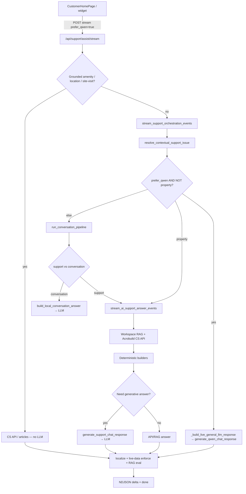

# Customer support chat flow

Primary path: widget → `/api/support/assist/stream` → orchestrator → (LLM | property/RAG/CS API).

## LLM provider switch

All generative calls go through `qwen.generate_qwen_chat_response`. Set `LLM_PROVIDER=qwen` (local) or `LLM_PROVIDER=sarvam` (RunPod OpenAI-compatible API). RAG, CS API, tickets, and grounded shortcuts are unchanged.
