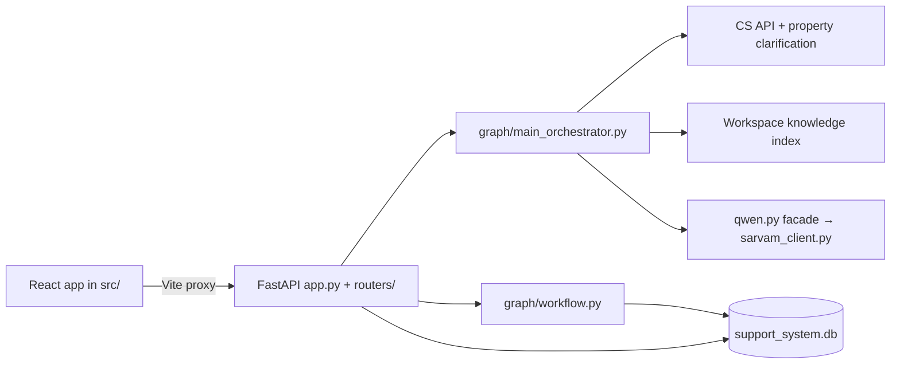

# AI context: AcroBuild Customer Support Agent

Use this page to brief another coding AI. Pair it with `AGENTS.md` for project
rules, then add source files for the task at hand. The source code is the final
authority; some older documents describe previous versions of the project.

## What the application does

The React/Vite app has a customer chat experience and a staff workspace for
tickets, articles, knowledge documents, macros, tags, workflow rules, and
business hours. The FastAPI backend answers chat, reads live real estate data
from AcroBuild's CS API, searches workspace knowledge, and stores support data
in SQLite. Chat generation uses Sarvam through an OpenAI-compatible HTTP API.

## Start and configuration

1. Install Python packages with `pip install -r requirements.txt` and frontend
   packages with `npm install`.
2. Copy `.env.example` to `.env` and provide the external service settings you
   need. Keep `.env` private.
3. Start the backend with `uvicorn app:api --reload` and the frontend with
   `npm run dev`. The default local URLs are `http://127.0.0.1:8000` and
   `http://127.0.0.1:5173`.
4. `GET /` checks only the local backend. Sarvam generation requires
   `RUNPOD_BASE_URL` and `RUNPOD_API_KEY`; set `MODEL_NAME` to the model served
   by that endpoint. The `RUNPOD_*` names are historical; the URL may be a
   direct Sarvam endpoint or a
   RunPod-hosted OpenAI-compatible endpoint. Live property answers require
   `ACROBUILD_CS_API_BASE_URL`, `ACROBUILD_CS_API_KEY`, and
   `ACROBUILD_CS_API_COMPANY_ID`, plus network access
   to that API. The two external services can fail independently.

## File map for another AI

| Work area | Read these files |
| --- | --- |
| App and HTTP contracts | `app.py`, `api_context.py`, relevant file in `routers/` |
| Chat routing | `routers/assist.py`, `graph/main_orchestrator.py`, `docs/CHAT_FLOW.md` |
| Property answers and clarification | `services/acrobuild_company_service.py`, `services/property_clarification_service.py`, `services/ai_agent_service.py` |
| LLM calls | `qwen.py`, `sarvam_client.py`, `services/llm_service.py` |
| Workspace knowledge/RAG | `services/knowledge_index_service.py`, `services/knowledge_ingestion_service.py` |
| Tickets and routing | `graph/workflow.py`, `services/ticket_metadata_service.py`, `services/database_service.py` |
| Authentication and staff workspace | `routers/sessions.py`, `routers/workspace.py`, `services/auth_service.py` |
| Frontend | `src/App.tsx`, task-specific files in `src/`, `src/lib/api.ts`, `vite.config.ts` |
| Dependencies and configuration | `requirements.txt`, `requirements/`, `package.json`, `.env.example` |
| Tests | Relevant files in `tests/`; use `scripts/live_disambiguation_check.py` for live property clarification acceptance |

## Behavior and boundaries

- `api_context.py` defines shared Pydantic request models and creates the
  FastAPI app. `app.py` registers route modules. The customer chat route has
  both JSON and streaming variants.
- Chat selects a conversational LLM path or a property/knowledge path. Property
  facts should come from the live CS API or workspace knowledge. When live data
  is unavailable, the assistant should say so instead of inventing inventory.
- Project, wing, floor, flat, and home-type disambiguation uses
  `services/property_clarification_service.py`. Read the mandatory contract in
  `AGENTS.md` before editing these flows.
- `qwen.py` retains old function names for callers but dispatches to Sarvam
  only. Local Qwen inference is not a supported chat provider.
- `support_system.db`, `.env`, logs, uploads, model caches, and generated
  `data/` content are local runtime artifacts. Do not use them as portable AI
  context or publish their contents.
- The long `docs/ONBOARDING.md` and other historical guides may contain stale
  architecture or security claims. Check current code before relying on them.

## Suggested context bundle

For a general handoff, share `AGENTS.md`, this file, `README.md`,
`docs/CHAT_FLOW.md`, and `.env.example`. For a specific change, add only the
relevant files from the table above. Never attach `.env`, the SQLite database,
or customer data.
