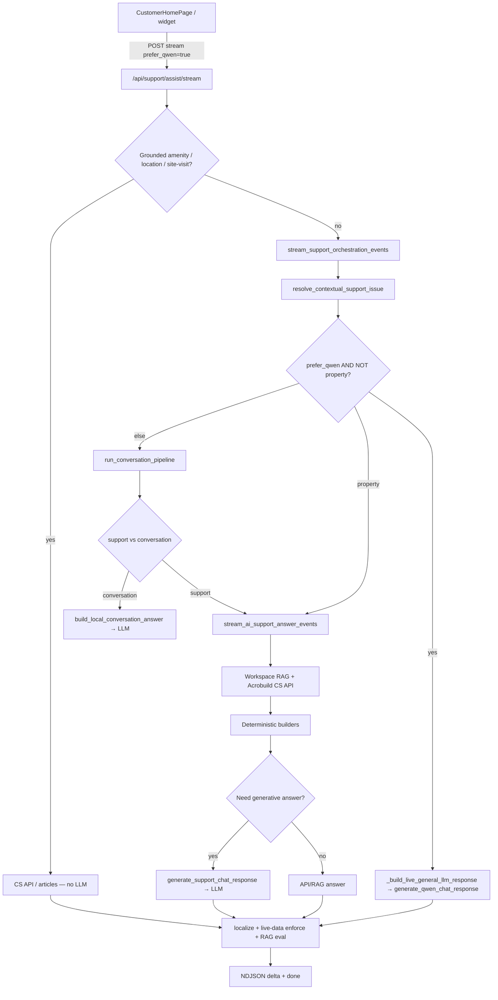

# Customer support chat flow

See [AI_CONTEXT.md](AI_CONTEXT.md) for the current architecture and file map.
`prefer_qwen_response` and `generate_qwen_chat_response` are retained names in
the code; the only supported generative provider is Sarvam.

Primary path: widget → `/api/support/assist/stream` → orchestrator → (LLM | property/RAG/CS API).

## LLM provider switch

All generative calls go through the `qwen.py` facade, which dispatches to
`sarvam_client.py`. It uses the configured OpenAI-compatible endpoint, either
direct Sarvam or a RunPod-hosted deployment. The live CS API is a separate
connection used for property data. RAG, tickets, and grounded shortcuts do not
switch chat providers.

### Property selection state

Project, wing, floor, flat, and home-type questions use the shared contract in
`services/property_clarification_service.py`. New builders declare
`clarification_entity`; a compatibility detector handles existing English
clarification prompts. Property generation stays in English until the contract
and relevance check finish, then the response is localized. Option names must
survive localization unchanged.

The server-only `pending_project_lookup` marker also accepts a structured
`selection` state: original question, current entity, live option names, selected
scope, and effective retry query. Both assist endpoints restore this state before
routing a short reply. Transient failures keep it without a one-retry cutoff;
new questions/actions replace it. The stored marker is not truncated with long
visible answers. Each resumed lookup re-reads live records.

See `docs/DISAMBIGUATION_AUDIT.md` for the audited generators and live evidence.
