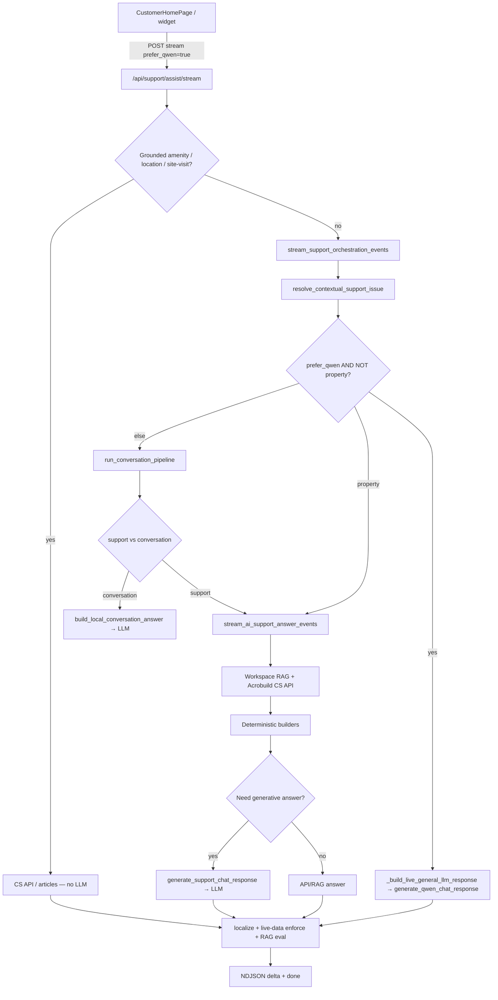

# Customer support chat flow

See [AI_CONTEXT.md](AI_CONTEXT.md) for the current architecture and file map.
`prefer_qwen_response` and `generate_qwen_chat_response` are retained names in
the code; the only supported generative provider is Sarvam.

Primary path: widget → `/api/support/assist/stream` → orchestrator → (LLM | property/RAG/CS API).

## LLM provider switch

All generative calls go through the `qwen.py` facade, which dispatches to
`sarvam_client.py`. It uses the configured OpenAI-compatible endpoint, either
direct Sarvam or a RunPod-hosted deployment. The live CS API is a separate
connection used for property data. RAG, tickets, and grounded shortcuts do not
switch chat providers.

### Property selection state

Project, wing, floor, flat, and home-type questions use the shared contract in
`services/property_clarification_service.py`. New builders declare
`clarification_entity`; a compatibility detector handles existing English
clarification prompts. Property generation stays in English until the contract
and relevance check finish, then the response is localized. Option names must
survive localization unchanged.

The server-only `pending_project_lookup` marker also accepts a structured
`selection` state: original question, current entity, live option names, selected
scope, and effective retry query. Both assist endpoints restore this state before
routing a short reply. Transient failures keep it without a one-retry cutoff;
new questions/actions replace it. The stored marker is not truncated with long
visible answers. Each resumed lookup re-reads live records.

A separate server-only `current_project` marker survives after a selection has
finished. It is updated by exact project-button selections and successful scoped
answers, so a bare follow-up such as `2bhk?` does not depend on whether the last
visible answer repeated the project name. A new catalogue search writes an
explicit empty marker to clear older scope.

See `docs/DISAMBIGUATION_AUDIT.md` for the audited generators and live evidence.

Reverse amenity searches also store matching projects as a pending selection and
return project quick replies. Detail follow-ups retain those offered options while
updating the requested information; selecting a project then resumes that request.
Explicit project names and new catalogue requests can replace the shortlist.

Catalogue home-type searches use the same selection pattern: `which projects have
3BHK?` filters live project typologies first, and selecting a result resumes the
original home-type request for that project. Explicit BHK signals are routed before
reverse amenity detection because both query shapes can say `what properties have`.

General discovery recognizes romanized Telugu `vunnayi` and English renderings
such as "What projects do you have with you?" before the generic property path.
Older discovery markers without `purpose: explore_project` are upgraded when
resumed, so selecting a project requests its overview instead of replaying the
catalogue question. Live discovery and Phase-V amenity evidence is captured by
`scripts/live_project_discovery_check.py` in `docs/live_project_discovery_results.json`.

### Project-scope exclusion in clarification candidates

`services/property_clarification_service.py`'s `_scope()` resolves the project
a clarification (wing/floor/flat/home-type) is about by checking the current
issue, then falling back through customer history. Explicit exclusionary
language ("other projects", "another project", "across projects", "which/all/
different projects") skips the history fallback entirely instead of handing
back the very project the customer is trying to move away from, so "what
about other projects?" offers the full catalogue rather than the one project
already in scope.

A numberless home-type question ("what bhks are available", "which home types
do you have") names no specific type, so it does not match the numbered
home-type builders. `services/project_home_type_service.py`'s
`build_generic_home_type_answer()` routes it through the same clarification
contract instead, so a project already unambiguous from context resolves
straight to the missing wing/home-type choice rather than re-asking for the
project.

### Catalogue-wide field filtering ("which projects have X?")

`services/acrobuild_company_service.py`'s `build_project_record_index()` /
`filter_project_index()` are the shared mechanism behind every "which
projects have X?" question (home type, amenity, and any future per-project
field): fetch one field's live records per project, skip (never abort on) any
single project whose live-and-snapshot fetch both fail, then filter by
requested value with an honest per-value breakdown. `project_home_type_service
.build_catalogue_home_type_answer()` and `amenity_search_service.live_amenity_
index()` / `projects_with_amenities()` both go through it. A project added to
the live catalogue after the on-disk snapshot was last regenerated (no
fallback data yet) is named in an honest "N project(s) could not be checked"
note instead of aborting the whole scan.

`requested_home_types()` recognizes plural mentions ("3bhks", not just
"3bhk"), and `is_catalogue_home_type_query()` recognizes demonstrative
references to an already-shown project set ("which one of these", "any of
these", "out of these") as well as the literal word "project(s)".

### Next-step quick replies after a terminal answer

`routers/assist.py`'s `_complete_payload()` offers **Browse all projects /
Book a site visit / Raise a support ticket** after any terminal property
answer (`source_status` in `live_api`/`snapshot`, no pending clarification, no
quick replies already set) — one gate shared by every answer type (amenities,
pricing, location, wing/floor/flat inventory, project overview), not a
per-answer-type feature. "Browse all projects" starts a fresh conversation
(new `conversation_id`, no carried-over scope) via the same reset mechanism
the guided-flow menu uses.

### Retry-aware live-data staleness

`api_context._enforce_live_property_data()` classifies a turn's answer as
`live_api`/`snapshot`/`failed` from that turn's `data_api_calls`. A single
turn can retry the same resource more than once (e.g. the project list is
re-fetched from several independent steps); only the **latest** call per
`(endpoint, params)` is authoritative, so an earlier timeout that a later
retry resolved live no longer makes the final answer falsely claim it used
saved/stale data.
