# ONBOARDING — AcroBuild Customer Support Agent

> New-engineer reference. Read Part A first, then use Part C as a lookup table.
> Goal: know the real names of things so you can ask for changes precisely.

---

## Part A — Orientation

### 1. What this app does (plain English)

AcroBuild sells real estate (apartment projects, wings/towers, unit typologies,
individual flats). This project is the **customer-support system** for those
buyers. It has two halves:

- A **Python FastAPI backend** that runs an AI support agent. The agent answers
  customer questions by combining a remote large language model (Sarvam via
  RunPod), a searchable knowledge base of help articles, and **live property
  data pulled from AcroBuild's "CS API"** (projects, prices, availability). It
  also creates and routes **support tickets** into a small SQLite database.
- A **React admin workspace** where staff (owner / admin / agent) work those
  tickets: an inbox, analytics, canned replies ("macros"), tag rules,
  business-hours config, and knowledge-base editing. There is also a
  customer-facing chat/home page.

Translation and text-to-speech run locally by default; chat generation
requires RunPod/Sarvam credentials.

---

### 2. High-level architecture

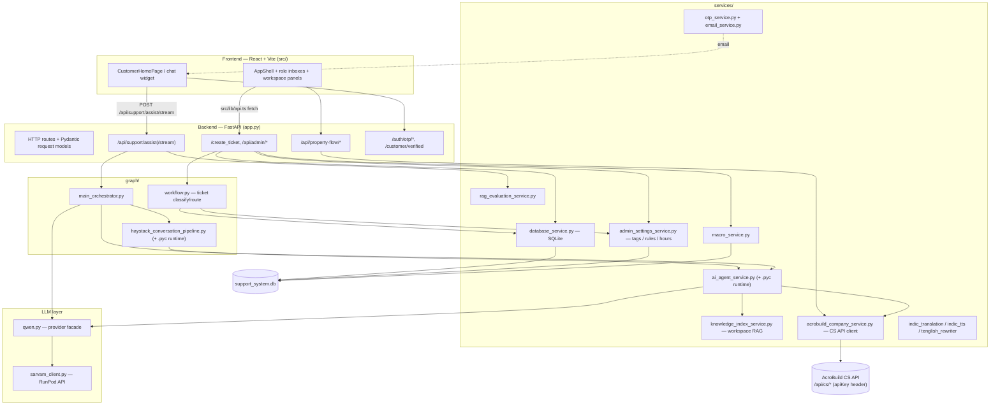

---

### 3. How to run it (quick reference)

**Backend**
```bash
pip install -r requirements.txt
uvicorn app:api --reload          # http://127.0.0.1:8000
```
`app:api` means "the object named `api` inside `app.py`". `initialize_database()`
runs on import and creates `support_system.db` if missing.

**Frontend**
```bash
npm install
npm run dev                       # http://127.0.0.1:5173  (Vite)
```

**Key environment variables** (`.env`, all optional)

| Var | Meaning |
|-----|---------|
| `LLM_PROVIDER` | always resolves to `sarvam` (remote RunPod); kept for forward compatibility |
| `RUNPOD_BASE_URL`, `RUNPOD_API_KEY`, `MODEL_NAME` | required for chat generation (Sarvam) |
| CS API base URL + `apiKey` | for `acrobuild_company_service.py` (live property data) |
| `HF_TOKEN` | one-time, for AI4Bharat translation/TTS models |
| `DATABASE_PATH` | override SQLite file location |

**Tests**
```bash
pytest tests/                     # ~15 files, mostly chat-response behavior
```

---

### 4. Glossary of this codebase

Use these exact words when asking for changes.

#### Roles (staff)
| Name in code | Where | Meaning |
|--------------|-------|---------|
| `admin` | `RoleId` in `src/contexts/RoleContext.tsx` | Full workspace. Demo login `admin@acrobuild.com` (Sarah Khan). |
| `owner` | same | Full workspace, same permissions as admin. Demo `owner@acrobuild.com` (Michael Ross). |
| `agent` | same | Frontline. **Inbox only** — every other panel is blocked. Demo `agent@acrobuild.com` (John Lewis). |

- `rolePermissionsMap` (`RoleContext.tsx`) — boolean capability flags per role
  (`canAssignTickets`, `canManageUsers`, `canEditMacros`, …).
- `rolePanelAccessMap` (`src/lib/roleNavigation.ts`) — which **workspace panels**
  each role may open. `agent` → `new Set(["inbox"])`.
- `roleExperienceMap` (`roleNavigation.ts`) — each role's home path + labels
  ("Admin Command Center", "Owner Oversight Hub", "Agent Service Desk").

#### Workspace panels (`WorkspacePanelId` in `roleNavigation.ts`)
`ai-agent`, `analytics`, `articles`, `business-hours`, `chat-widget`, `inbox`,
`knowledge-base`, `macros`, `manage-tags`, `order-track`, `products`, `rules`,
`shopping-assistant`, `support-actions`, `ticket-dashboard`, `users`.

#### Support agents (auto-assignment targets) — `AGENT_DIRECTORY` in `services/ticket_metadata_service.py`
| Agent | Team | Handles |
|-------|------|---------|
| `Agent Priya` | Sales Advisory | Sales, Quotation Request, Availability Check |
| `Agent Omar` | Project Finance | Payments, Payment Plan, Refund Review |
| `Agent Kavya` | Documentation Desk | Documentation, Legal Documentation, Account Access |
| `Agent Arjun` | Site Operations | Construction, Site Visit, Construction Update |
| `Agent Neha` | Handover and Care | Handover, Maintenance |
| `Agent Rohan` | Priority Escalations | VIP / investor escalations |

#### Issue categories — `classify_issue()` in `graph/workflow.py`
`Payments`, `Account`, `Documentation`, `Site Visit`, `Handover`,
`Maintenance`, `Construction`, `Sales`, `General`.

#### Intent tags — `classify_intent_tag()` in `ticket_metadata_service.py`
`Refund Review`, `Payment Plan`, `Account Access`, `Site Visit Request`,
`Construction Update`, `Legal Documentation`, `Possession / Handover`,
`Maintenance Request`, `Broker / Channel Partner`, `Quotation Request`,
`Availability Check`, `General Inquiry`.

#### Priorities — `set_priority()` in `graph/workflow.py`
`High`, `Medium`, `Low` (safety keywords force `High`; VIP bumps one level).

#### Ticket statuses — `STATUS_OPTIONS` in `ticket_metadata_service.py`
`Open`, `In Progress`, `Waiting on Customer`, `Resolved`, `Closed`.

#### Business-hours tags — `BUSINESS_HOURS_OPTIONS`
`Business Hours`, `After Hours`, `Weekend Coverage`.

#### Queues — `build_queue_name()` in `ticket_metadata_service.py`
`Priority Investor Desk`, `Project Finance Desk`, `Site Operations Desk`,
`Documentation Desk`, `Handover and Maintenance Desk`, `Sales Advisory Desk`,
`Priority Response`, `<IssueType> Queue`.

#### Chat "modes" (fields on every assist response payload)
| Field | Values you'll see | Meaning |
|-------|-------------------|---------|
| `agent_mode` | `knowledge_retrieval`, `live_data_error`, `fallback`, LLM modes | how the answer was produced |
| `retrieval_mode` | `knowledge_base`, `live_project_records`, `live_api`, `live_api_error`, `none`, `empty` | where evidence came from |
| `source_status` | `live`, `live_api`, `workspace`, `failed`, `fallback` | trust level of the source |
| `confidence_label` | `high`, `medium`, `low` | agent's self-rating |
| `handoff_recommended` | bool | should a human take over |
| `used_llm` | bool | was the LLM actually called |
| `data_api_calls` | list | trace of every CS API call made (drives the "Data API logs" panel) |
| `rag_evaluation` | dict | scores from `rag_evaluation_service.evaluate_rag_response` |

#### Key services (one line each)
| Module | Role |
|--------|------|
| `services/database_service.py` | SQLite: tickets, messages, notes, users, articles, knowledge docs |
| `services/ai_agent_service.py` | Property-support answer engine (loads a compiled `.pyc` runtime) |
| `services/knowledge_index_service.py` | The RAG: chunk + search articles & knowledge docs ("workspace index") |
| `services/knowledge_ingestion_service.py` | Import knowledge from uploaded files / URLs |
| `services/acrobuild_company_service.py` | HTTP client for the external AcroBuild CS API (+ snapshot fallback + TTL cache) |
| `services/internal_api_log_service.py` | Per-request trace of CS API calls for the UI |
| `services/admin_settings_service.py` | Tags, ticket-tags, business-hours profiles, workflow rules |
| `services/macro_service.py` | Canned replies + per-ticket recommendation scoring |
| `services/ticket_metadata_service.py` | Agent directory, intent tags, queues, routing rules |
| `services/rag_evaluation_service.py` | Scores each answer for grounding/relevance |
| `services/otp_service.py` | Customer email OTP verification (in-memory) |
| `services/auth_service.py` | bcrypt + JWT helpers — **currently not wired to any route** |
| `services/email_service.py` | Sends OTP emails |
| `services/indic_translation_service.py` | AI4Bharat IndicTrans2 (English → Indian languages) |
| `services/indic_tts_service.py` | AI4Bharat Parler-TTS (voice replies) |
| `services/tenglish_rewriter_service.py` | Telugu-in-Latin-script rewriting |
| `services/local_product_feed_service.py` | Serves local CSV product feeds as HTML/CSV |
| `services/support_article_service.py` | Support base URL + article helpers |
| `qwen.py` | LLM provider **facade** — all generation goes through `generate_qwen_chat_response` |
| `sarvam_client.py` | RunPod OpenAI-compatible client (remote LLM) |

---

## Part B — Authentication, authorization & roles (end to end)

There are **three separate identity concepts** here. Keep them apart.

### B1. Staff login (frontend only, demo-grade)

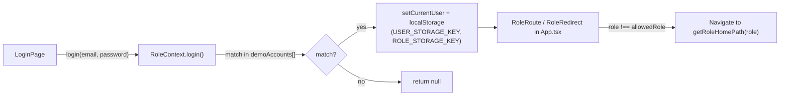

- Accounts are **hard-coded** in `demoAccounts` (`src/contexts/RoleContext.tsx`),
  password `demo@123`. No backend call, no token — identity lives in
  `localStorage`.
- `RoleProvider` exposes `role`, `permissions` (`rolePermissionsMap[role]`),
  `login`, `logout`, `setRole`.
- Route protection: `RoleRoute allowedRole=…` and `RoleRedirect` in
  `src/App.tsx`. Panel gating: `canRoleAccessPanel()` in `roleNavigation.ts`.
- **This is client-side only** — a determined user can flip `localStorage`. It is
  a demo access model, not real security.

### B2. Backend user records

`support_users` table (seeded by `seed_default_support_users` in
`database_service.py`) stores `name, email, role, team, status, password`.
`role` is `owner` / `admin` / `agent`. These records power the **Users panel**
and agent pickers — they are **not** checked on API calls.

### B3. Customer email verification (OTP) — real, but lightweight

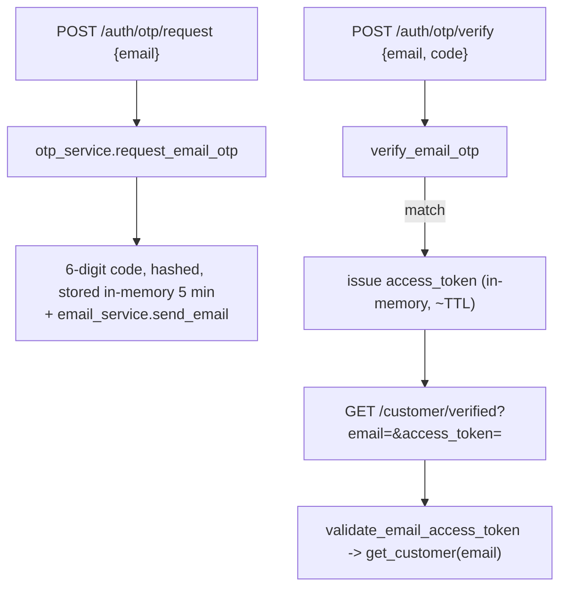

- All state is **process memory** (`OTP_RECORDS`, `ACCESS_TOKENS` dicts) — lost
  on restart, not shared across workers.
- Guards: 5-minute code TTL, resend cooldown, max attempts.
- Used by the customer-facing order/project lookup, not by staff.

### B4. CS API auth (external)

`acrobuild_company_service.py` calls the external AcroBuild REST API with an
`apiKey` **header** (see `cs-api.md`). Company scope is fixed server-side; the
client never passes `companyId`.

### B5. What is NOT protected

- Every `/api/admin/*` route in `app.py` is **unauthenticated**. Anyone who can
  reach the backend can read/modify tickets, users, articles, rules.
- CORS is wide open: `allow_origins=["*"]`, `allow_methods=["*"]`.
- `auth_service.py` has `hash_password` / `verify_password` / `create_access_token`
  ready to use, but no route calls them.

> **Precise phrasing example:** "Add a dependency on `app.py`'s `/api/admin/*`
> routes that validates a staff JWT via `auth_service.create_access_token`,
> and check `role` against `rolePermissionsMap` equivalents on the backend."

---

## Part C — Module by module

Each module: data-flow diagram → key files/functions → short narrative →
"quiz me" → exact terminology for change requests.

---

### C1. Backend API layer — `app.py`

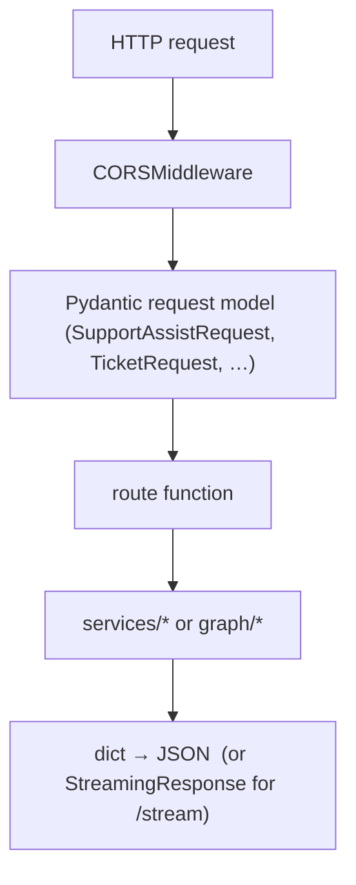

**Key pieces**
- `api = FastAPI()` + `CORSMiddleware` — the single app object (`app:api`).
- `initialize_database()` — called at import time; builds SQLite schema.
- `@api.on_event("startup") warm_ai_knowledge_index()` — optional model/index
  warmup gated by env flags.
- Request models: `SupportAssistRequest`, `TicketRequest`, `SiteVisitRequest`,
  `AdminTicketReplyRequest`, `MacroRequest`, `WorkflowRuleUpdateRequest`, … (all
  at the top of the file).
- `get_support_assist()` / `stream_support_assist()` — the chat endpoints; they
  try grounded shortcuts first, then hand off to the orchestrator, then
  post-process (`_enforce_live_property_data`, `localize_ai_answer`,
  `evaluate_rag_response`).
- `build_grounded_site_visit_document_assist` / `_project_amenities_assist` /
  `_project_location_assist` — deterministic, no-LLM answers built straight from
  CS API data, checked before the LLM path.
- `_enforce_live_property_data()` — for property questions, strips cached/local
  evidence and forces a "live data unavailable" answer if the CS API failed.

**Narrative.** `app.py` is ~2400 lines of thin route handlers. It owns request
validation, response shaping, and the "grounded shortcut" pre-checks, but
delegates all real logic to `graph/` and `services/`. Most admin routes are
registered under **both** `/api/admin/...` and `/admin/...` paths.

**Quiz me:** A customer asks "what amenities does Sunrise Towers have?" — which
function in `app.py` answers it, and does the LLM run?

**To request a change here, say:** "in `app.py`, the `stream_support_assist`
route" / "the `SupportAssistRequest` model" / "the `_enforce_live_property_data`
guard" / "the grounded amenities shortcut `build_grounded_project_amenities_assist`".

---

### C2. Chat / Assist orchestration — `graph/`

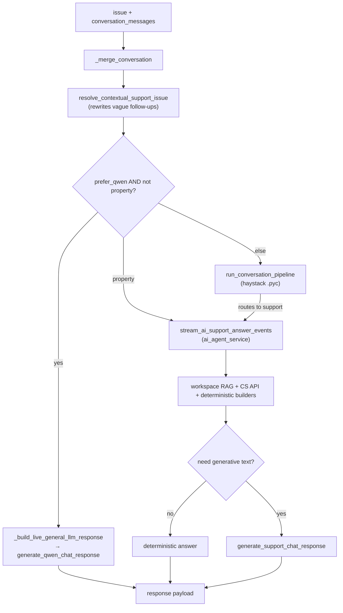

**Key files/functions**
- `graph/main_orchestrator.py` → `run_support_orchestration()` and
  `stream_support_orchestration_events()` — the top-level entry the API calls.
- `main_orchestrator._build_live_general_llm_response()` — general-knowledge
  path; builds the "Acrobuild Support" system prompt, calls the LLM, then applies
  deterministic overrides (date/time, social replies, a few hard-coded facts).
- `graph/haystack_conversation_pipeline.py` — thin wrapper that `exec`s
  `haystack_conversation_pipeline_runtime.pyc`. Public: `is_property_support_message`,
  `resolve_contextual_support_issue`, `run_conversation_pipeline`,
  `validate_support_node`, `build_deterministic_conversation_answer`,
  `is_small_talk_message`.
- `services/ai_agent_service.py` — thin wrapper that `exec`s
  `ai_agent_service_runtime.pyc`. Public: `build_ai_support_answer`,
  `stream_ai_support_answer_events`, `localize_ai_answer`,
  `answer_matches_response_language`, `clear_assist_response_cache`.
  Readable helpers: `_build_contextual_flat_cost_answer`,
  `_build_budget_project_recommendation`, `_build_portfolio_overview_answer`,
  `build_company_api_direct_answer`, …

**Narrative.** The orchestrator decides *which brain* answers: a plain LLM for
general chat, or the property-support engine for anything about projects /
prices / availability / site visits. The property engine prefers **deterministic
answers computed from live CS API data** and only calls the LLM when it needs to
phrase something. `resolve_contextual_support_issue` is important: it turns
"how much does this cost?" into a full question using earlier messages.

**Caveat.** The core of both the property engine and the haystack pipeline is
compiled `.pyc` — you can change the wrappers and helpers, but not the compiled
internals without the original source.

**Quiz me:** Which single function decides whether a message goes to the general
LLM or the property engine?

**To request a change here, say:** "in `graph/main_orchestrator.py`,
`run_support_orchestration`'s branch selection" / "the general-chat system prompt
in `_build_live_general_llm_response`" / "`resolve_contextual_support_issue` in
`haystack_conversation_pipeline.py`" / "the `_build_budget_project_recommendation`
helper in `ai_agent_service.py`".

---

### C3. Ticket workflow — `graph/workflow.py`

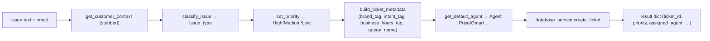

**Key functions**
- `run_workflow(issue, customer_email, attachments=None)` — the whole pipeline;
  called by `POST /create_ticket` and `POST /api/site-visits`.
- `classify_issue(issue, customer_context)` — keyword rules → issue category.
- `set_priority(issue_type, customer_context, issue)` — base priority per
  category; safety keywords force `High`; VIP bumps a level.
- `assign_agent()` / `ticket_metadata_service.get_default_agent()` — intent tag →
  agent; VIP → `Agent Rohan`.
- `ticket_metadata_service.build_ticket_metadata()` — brand tag, intent tag,
  business-hours tag, queue name, timestamps.
- `ticket_metadata_service.classify_intent_tag()` — finer-grained than
  `classify_issue`; drives routing and queues.

**Narrative.** Pure keyword/rule engine, no LLM. `get_customer_context()` is
**stubbed** — it always returns `DEFAULT_CUSTOMER_CONTEXT` (never VIP), so the
VIP escalation paths exist but never fire today. Docs mentioning "Agent Sarah",
"NDIS", "NuFoodz VIP detection" are **stale** — trust the code.

**Quiz me:** A ticket says "there's a water leakage in Tower B, urgent" — what
issue category, priority, and agent does it get?

**To request a change here, say:** "in `graph/workflow.py`, `classify_issue`'s
keyword list" / "`set_priority`'s safety-keyword override" / "the intent→agent
map in `ticket_metadata_service.get_default_agent`" / "wire up
`get_customer_context` to real data".

---

### C4. LLM provider layer — `qwen.py` / `sarvam_client.py` / `services/llm_service.py`

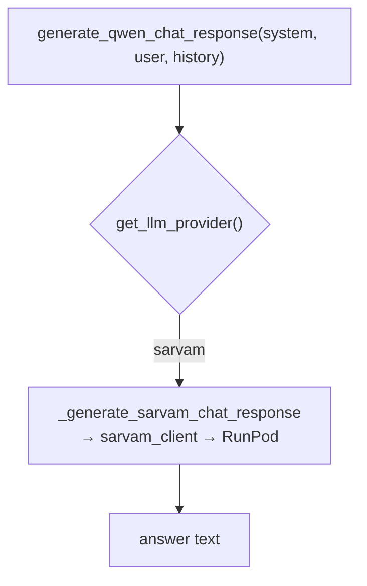

**Key functions (all in `qwen.py`)**
- `get_llm_provider()` — always `sarvam`; kept as a facade in case another provider is added later.
- `generate_qwen_chat_response(...)` — **the facade every generation call uses.**
- `stream_qwen_chat_response(...)` — token streaming variant.
- `build_qwen_messages()` — assembles system + history + user into chat format.
- `get_qwen_model_name` / `get_llm_source_label` / `get_llm_agent_mode` — labels
  that show up in the response payload and UI.

**Narrative.** One facade, one backend (RunPod-hosted Sarvam, OpenAI-compatible
endpoint). The local Qwen model/runtime was removed; the module keeps its
"qwen"-prefixed function names because they're called from across the codebase
as the generic LLM-dispatch layer.

**Quiz me:** If you set `LLM_PROVIDER=sarvam` but forget `RUNPOD_BASE_URL`, where
does it fail and what does the customer see?

**To request a change here, say:** "in `qwen.py`, `generate_qwen_chat_response`" /
"the provider switch `get_llm_provider`" / "`_generate_sarvam_chat_response`" /
"`build_qwen_messages` prompt assembly".

---

### C5. RAG / knowledge base — `services/knowledge_index_service.py` (+ ingestion, + legacy)

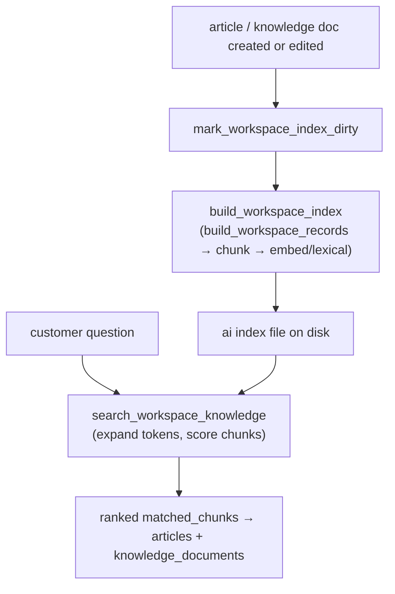

**Key functions**
- `build_workspace_index()` / `refresh_workspace_index()` /
  `refresh_workspace_index_async()` — (re)build the searchable index from DB
  articles + knowledge docs + macros.
- `build_workspace_records()` — pulls the source rows.
- `split_text_into_chunks()` / `build_chunk_entries()` — chunking.
- `search_workspace_knowledge(query, limit, …)` — the retrieval entry point;
  uses `expand_query_tokens`, `score_chunk_lexically`, `compute_cosine_similarity`,
  `is_chunk_relevant`.
- `mark_workspace_index_dirty()` — invalidate after content edits (called from
  every article/knowledge admin route via `refresh_support_assist_state`).
- `services/knowledge_ingestion_service.py` → `ingest_url_knowledge_source`,
  `ingest_uploaded_knowledge_files` — turn a URL or uploaded file into knowledge
  docs.
**Narrative.** "RAG" here = the **workspace index**: help articles + imported
knowledge docs, chunked and scored with a hybrid lexical + embedding approach.
It's rebuilt whenever staff edit content. `is_semantic_search_enabled()` gates
the embedding half; lexical scoring is the fallback.

**Quiz me:** You add a new published support article. What must happen before the
chat agent can cite it, and which function triggers that?

**To request a change here, say:** "in `knowledge_index_service.py`,
`search_workspace_knowledge` scoring" / "`split_text_into_chunks` chunk size" /
"the index-dirty trigger in `app.py`'s `refresh_support_assist_state`" / "URL
ingestion in `knowledge_ingestion_service.ingest_url_knowledge_source`".

---

### C6. AcroBuild CS API integration — `services/acrobuild_company_service.py` + `internal_api_log_service.py`

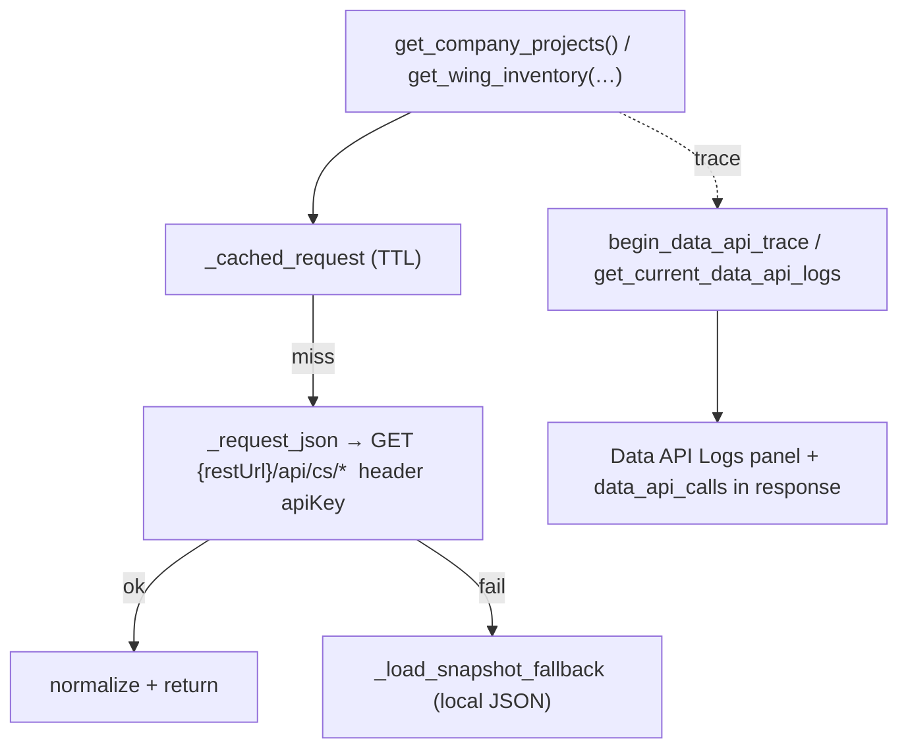

**Key functions (`acrobuild_company_service.py`)**
- `get_company_projects()`, `get_project_wings(project_id)`,
  `get_wing_typologies(wing_id)`, `get_wing_inventory(wing_id, available_only)` —
  the four data getters. Backed by `/api/property-flow/*` routes in `app.py`.
- `resolve_project_from_text(projects, text)` — fuzzy-match a project name from
  free text (used everywhere the customer names a project).
- `search_company_knowledge(query, …)` — turn CS API data into
  `matched_chunks` the agent can cite (`record_kind: "company_api"`).
- `_cached_request()` — in-process TTL cache; `_load_snapshot_fallback()` —
  reads a committed JSON snapshot when the live API is down.
- `is_cs_api_configured()` / `get_cs_api_status()` — health.
- `export_all_company_data_to_text()` / `refresh_company_data_snapshot_async()` —
  snapshot maintenance.

**`internal_api_log_service.py`:** `begin_data_api_trace(conversation_id, question)`,
`end_data_api_trace(token)`, `get_current_data_api_logs()` — records each CS API
call (provider, status, cache_hit, error, timing) so the UI and
`_enforce_live_property_data` can see whether the answer used live data.

**Narrative.** This is the bridge to real property data. The system is strict:
for property questions, if a live call **failed** or only cached/snapshot data
was available, `_enforce_live_property_data` in `app.py` refuses to answer from
memory and tells the customer live data is unavailable.

**Quiz me:** The CS API times out during a "what 2BHK flats are available in
Tower A" question. What does the customer get back, and why not the snapshot?

**To request a change here, say:** "in `acrobuild_company_service.py`,
`_cached_request` TTL" / "`resolve_project_from_text` matching" / "the snapshot
fallback `_load_snapshot_fallback`" / "the trace fields in
`internal_api_log_service`".

---

### C7. Database — `services/database_service.py` (SQLite `support_system.db`)

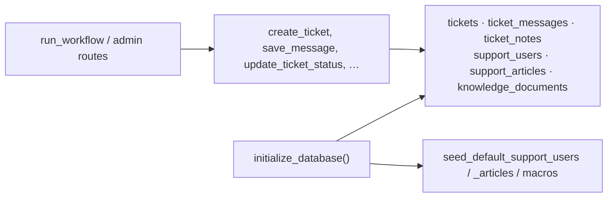

**Key functions**
- `initialize_database()` — idempotent schema build + migrations
  (`ensure_column`, legacy ticket-ID migration) + seeds.
- `create_ticket(...)` / `generate_next_ticket_id()` — new ticket + human ID.
- `get_all_tickets()`, `get_ticket(id)`, `get_ticket_messages(id)`,
  `get_ticket_notes(id)`.
- `save_message(ticket_id, sender, message, attachments=)` — customer/agent
  message + file handling (`persist_message_attachments`,
  `MESSAGE_UPLOAD_DIR`).
- `save_ticket_note(...)` — internal notes.
- `update_ticket_status`, `update_ticket_agent`, `close_ticket`, `reset_unread`.
- `create/update support_user`, `support_article`, `knowledge_document` families.
- `seed_default_support_users` — owner/admin/agent + Anika Patel (agent).

**Narrative.** One SQLite file, plain `sqlite3`, no ORM. Schema evolves via
`ensure_column` calls inside `initialize_database` (additive, non-destructive).
Attachments are stored on disk under `MESSAGE_UPLOAD_DIR` and served through
`/api/admin/attachment` with a path-traversal check.

**Quiz me:** Where do uploaded reply images physically go, and what stops
`/api/admin/attachment?path=../../secret` from working?

**To request a change here, say:** "in `database_service.py`, the `tickets`
schema in `initialize_database`" / "`create_ticket`" / "`save_message`
attachment handling" / "add an index on `tickets.customer_email`".

---

### C8. Admin settings — tags, workflow rules, business hours (`services/admin_settings_service.py`) + macros (`services/macro_service.py`)

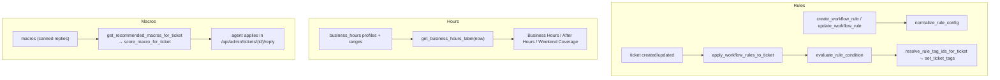

**Key functions**
- Tags: `get_tags`, `create_tag`, `merge_tags`, `get_ticket_tags`,
  `set_ticket_tags`.
- Rules: `get_workflow_rules`, `create_workflow_rule`, `update_workflow_rule`,
  `apply_workflow_rules_to_ticket(ticket_id)`, `evaluate_rule_condition(...)`,
  `restore_default_workflow_rule`. A rule maps a condition → apply
  `true_tag_id` / `false_tag_id`.
- Business hours: `get_business_hours_profile(s)`, `create/update/delete_business_hours_profile`,
  `is_within_business_hours`, `get_business_hours_label`,
  `sync_business_hours_rule_windows`.
- Macros (`macro_service.py`): `get_macros`, `create_macro`, `update_macro`,
  `duplicate_macro`, `archive_macro`, `render_macro_template` (handles
  `{{ customer_first_name }}` etc.), `score_macro_for_ticket`,
  `get_recommended_macros_for_ticket`, `increment_macro_usage`.

**Narrative.** This is the "no-code automation" layer staff configure from the
workspace. Workflow rules auto-tag tickets; business-hours profiles decide the
`business_hours_tag`; macros are reusable replies with template variables and a
per-ticket relevance score.

**Quiz me:** An agent applies a macro that has `set_status: "Resolved"` and tag
`["Escalation"]`. Name the two side effects on the ticket and the function in
`app.py` that performs them.

**To request a change here, say:** "in `admin_settings_service.py`,
`evaluate_rule_condition`" / "`apply_workflow_rules_to_ticket`" /
"`get_business_hours_label`" / "in `macro_service.py`, `score_macro_for_ticket`
weighting" / "`render_macro_template` variables".

---

### C9. RAG evaluation — `services/rag_evaluation_service.py`

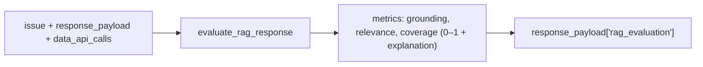

**Key functions:** `evaluate_rag_response(issue, response_payload, data_api_calls)`,
`_metric()`, `_chunk_text()`, `_tokens()`, `_clamp()`.

**Narrative.** Runs after every assist response. Compares the answer text to the
evidence chunks and the question tokens, produces small scored metrics that the
UI shows as a quality readout. Purely observational — it does not block or
rewrite answers.

**Quiz me:** Does a low `rag_evaluation` score change what the customer sees?

**To request a change here, say:** "in `rag_evaluation_service.py`,
`evaluate_rag_response`'s grounding metric".

---

### C10. Language / localization — `indic_translation_service.py`, `indic_tts_service.py`, `tenglish_rewriter_service.py`

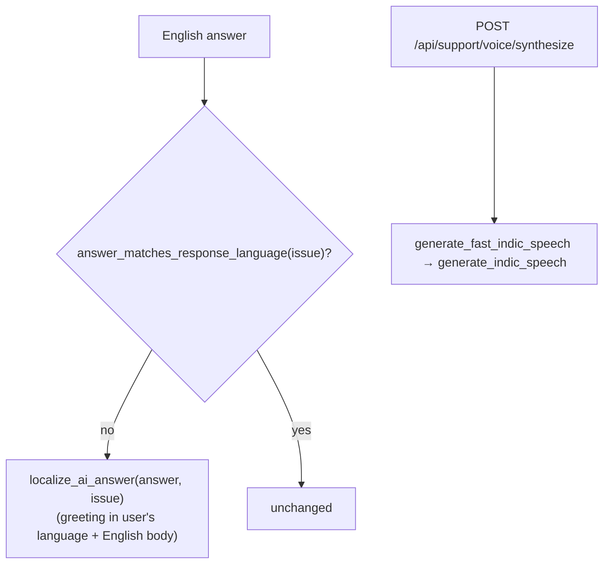

**Key pieces**
- `ai_agent_service.answer_matches_response_language()` /
  `localize_ai_answer()` — detect the customer's language and prepend a
  one-word greeting (నమస్తే, नमस्ते, …) while keeping the body in English.
- `indic_translation_service.py` — AI4Bharat **IndicTrans2**
  (`ai4bharat/indictrans2-en-indic-dist-200M`); `warm_translation_model_async()`.
- `indic_tts_service.py` — AI4Bharat **Parler-TTS**; `generate_indic_speech`,
  `generate_fast_indic_speech`; served by `/api/support/voice/synthesize`.
- `tenglish_rewriter_service.py` — rewrites answers into "Tenglish" (Telugu
  written in Latin script) when detected.

**Narrative.** The product answers in **English prose with a localized
greeting**, not full translation. TTS is a separate opt-in feature for voice
replies. All models are local (need `HF_TOKEN` once to download).

**Quiz me:** A customer writes entirely in Hindi script. What language is the
answer body in, and what gets prepended?

**To request a change here, say:** "in `ai_agent_service`, `localize_ai_answer`
greeting logic" / "`indic_tts_service.generate_indic_speech` voice/description" /
"the Tenglish trigger in `tenglish_rewriter_service`".

---

### C11. Frontend workspace — `src/`

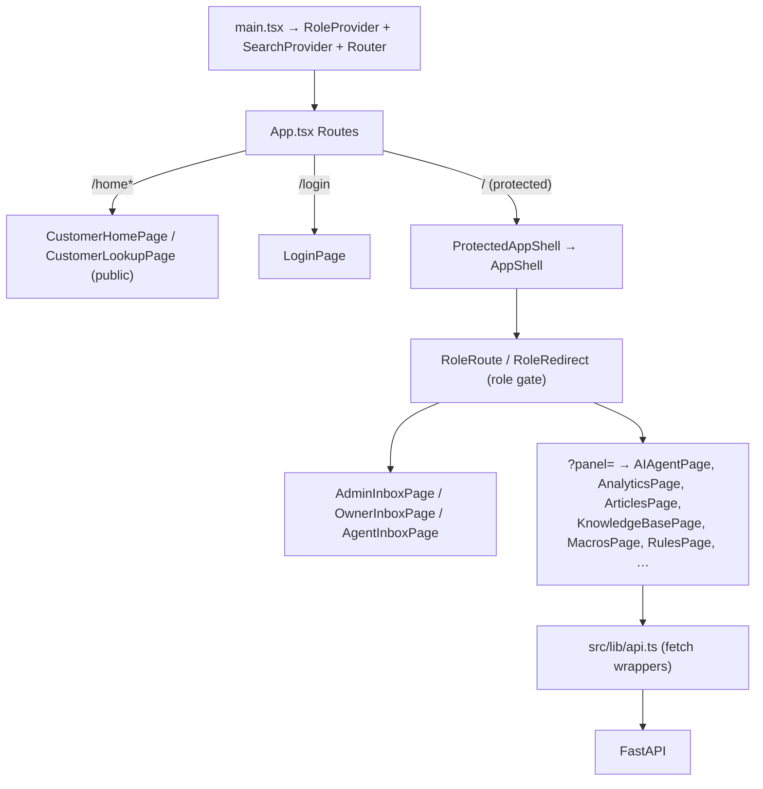

**Key files**
- `src/main.tsx` — mounts providers + `BrowserRouter`.
- `src/App.tsx` — all routes + role guards (`RoleRoute`, `RoleRedirect`).
- `src/components/AppShell.tsx` — sidebar, global ticket search, logout; renders
  `<Outlet/>`.
- `src/contexts/RoleContext.tsx` — auth/role state (see Part B).
- `src/contexts/SearchContext.tsx` — cross-page ticket search.
- `src/lib/api.ts` — **every** backend call (`getSupportAssist`,
  `streamSupportAssist`, `getAdminTickets`, `postAdminTicketReply`,
  `getWorkflowRules`, …). Change API shapes here.
- `src/lib/roleNavigation.ts` — panels, aliases, per-role access.
- `src/lib/ticketPresentation.ts`, `analyticsPresentation.ts`,
  `articleAssist.ts`, `widgetConfig.ts`, `apiActivity.ts` — view-model helpers.
- `src/pages/*` — one file per screen. Inbox pages per role; panel pages for
  each `WorkspacePanelId`; `CustomerHomePage` + `CustomerLookupPage` are the
  public customer surface.
- `src/types.ts` — shared TypeScript types.

**Narrative.** Vite + React Router SPA, no state library — React context +
`localStorage`. The `admin`/`owner` inbox is really a shell that swaps
"workspace panels" via a `?panel=` query param; `agent` is locked to the inbox.
All server communication funnels through `src/lib/api.ts`.

**Quiz me:** An `agent` user manually navigates to `/admin/analytics`. What
happens and which component enforces it?

**To request a change here, say:** "in `src/App.tsx`, the `RoleRoute` for
`admin/analytics`" / "`src/lib/api.ts`'s `streamSupportAssist`" / "the
`AdminInboxPage` panel switcher" / "`rolePanelAccessMap` in `roleNavigation.ts`".

---

## Part D — Appendix

### D1. Backend endpoints (grouped)

| Group | Endpoints |
|-------|-----------|
| Health | `GET /`, `GET /api/health` |
| Chat | `POST /api/support/assist`, `POST /api/support/assist/stream`, `POST /api/support/voice/synthesize` |
| Tickets (public) | `POST /create_ticket`, `POST /ticket/message`, `POST /api/site-visits` |
| Property data | `GET /api/property-flow/projects`, `/projects/{id}/wings`, `/wings/{id}/typologies`, `/wings/{id}/inventory` |
| Customer | `GET /customer`, `GET /orders`, `POST /auth/otp/request`, `POST /auth/otp/verify`, `GET /customer/verified` |
| Actions (stub) | `POST /order/refund`, `POST /subscription/cancel` |
| Admin — tickets | `GET /api/admin/tickets`, `GET /api/admin/tickets/{id}/detail`, `POST .../messages`, `POST .../reply`, `POST .../notes`, `POST .../read`, `POST .../close`, `PUT .../status`, `PUT .../assign`, `PUT .../tags`, `GET .../recommended-macros` |
| Admin — users | `GET/POST /api/admin/users`, `PUT /api/admin/users/{id}` |
| Admin — articles | `GET/POST /api/admin/articles`, `PUT /api/admin/articles/{id}` |
| Admin — knowledge | `GET/POST /api/admin/knowledge-documents`, `PUT /{id}`, `POST /upload`, `POST /import-url`, `POST /delete`, `POST /reset` |
| Admin — tags | `GET/POST /api/admin/tags`, `PUT/DELETE /{id}`, `POST /merge` |
| Admin — macros | `GET/POST /api/admin/macros`, `GET/PUT /{id}`, `POST /{id}/duplicate`, `POST /{id}/archive`, `DELETE /{id}` |
| Admin — workflow rules | `GET/POST /api/admin/workflow-rules`, `PUT/DELETE /{id}`, `GET /{id}/affected`, `GET /windows`, `POST /{id}/duplicate`, `POST /restore-default` |
| Admin — business hours | `GET /api/admin/business-hours/profiles`, `GET /default`, `POST /profiles`, `PUT/DELETE /profiles/{id}` |
| Attachments | `GET /api/admin/attachment?path=` |
| Product feeds | `GET /api/local-product-feeds`, `GET /local-data/products/{key}`, `GET /local-data/products/{key}.csv` |

(Many admin routes also exist without the `/api` prefix.)

### D2. Known caveats / gotchas

1. **Compiled logic.** `services/ai_agent_service_runtime.pyc` and
   `graph/haystack_conversation_pipeline_runtime.pyc` hold the core of the
   property engine and conversation router. The `.py` files only wrap them. No
   readable source for the internals.
2. **Stale docs.** `README.md`, `SETUP_AND_USAGE.md`, `TEST_CHATBOT_RESPONSES.md`
   describe an older "NuFoodz / NDIS / Agent Sarah / butler-English" version.
   The live domain is AcroBuild real estate. Trust the code and this file.
   `services/__pycache__/nufoodz_*.pyc`, `ollama_service.pyc` are dead leftovers.
3. **No backend auth.** All `/api/admin/*` routes are open; CORS is `*`.
   `auth_service.py` exists but is unused.
4. **Staff auth is client-side only** — `demoAccounts` + `localStorage`.
5. **`get_customer_context()` is stubbed** — always non-VIP, so VIP escalation
   (`Agent Rohan`, priority bumps) never triggers in practice.
6. **OTP state is in-memory** — not restart-safe, not multi-worker-safe.
7. **Hard-coded secret.** `cs-api.md` contains a literal `api-key` value. Treat
   as compromised; do not reuse.
8. **Dead-code cleanup (done).** A duplicate `webapp/` frontend, the unused
   legacy `services/rag_service.py`, backup `CustomerHomePage.*` variants, the
   compiled `vite.config.js`, and stray log/preview artifacts were removed. The
   canonical frontend is the repo-root `src/` (`npm run dev` from root). Older
   docs still mentioning `webapp/` or `rag_service` are stale.

---

## Part 2 — Interactive walkthrough (dependency order)

We'll go in this order, one concept per message, with a quiz after each:

1. Entry points & how a request enters the system (`app.py`, `src/App.tsx`)
2. The chat orchestrator decision tree (`graph/main_orchestrator.py`)
3. The property-support engine + CS API (`ai_agent_service`, `acrobuild_company_service`)
4. The workspace RAG index (`knowledge_index_service.py`)
5. Ticket creation & routing (`graph/workflow.py`, `ticket_metadata_service.py`)
6. The database (`database_service.py`)
7. Admin settings: tags, rules, business hours, macros
8. The LLM provider facade (`qwen.py`)
9. Localization / voice
10. The React workspace & role gating

_Ask to begin and we'll start with step 1._
